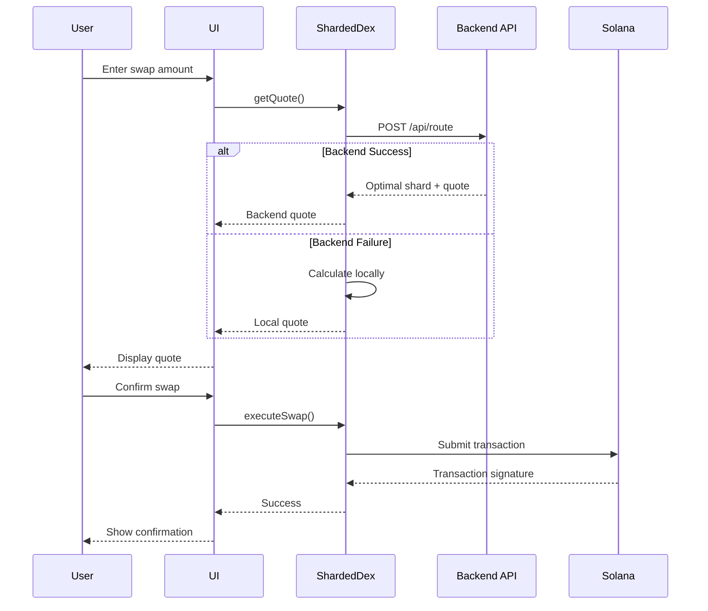
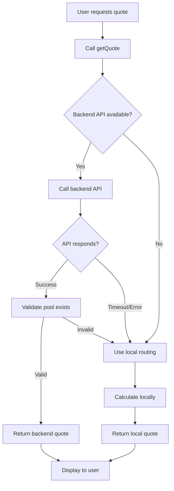

# RocketSAMM DEX

A modern, high-performance decentralized exchange (DEX) built on Solana with intelligent shard routing and dynamic liquidity management.

## Features

- **Intelligent Shard Routing**: Automatic selection of optimal liquidity pools using backend API analysis
- **Multi-Shard Support**: Trade across multiple liquidity pool shards for the same token pair
- **Real-Time Quotes**: Get accurate swap quotes with price impact calculations
- **Liquidity Management**: Add and remove liquidity from pools
- **Transaction History**: Track all your swaps and liquidity operations
- **Wallet Integration**: Support for Phantom, Solflare, and other Solana wallets
- **Responsive UI**: Premium glassmorphic design with mobile support

## Quick Start

### Prerequisites

- Node.js 18+ and npm
- A Solana wallet (Phantom, Solflare, etc.)
- SOL for transaction fees

### Installation

```bash
# Clone the repository
git clone <repository-url>
cd RocketSAMM

# Install dependencies
npm install

# Copy environment template
cp .env.example .env.local

# Start development server
npm run dev
```

Visit `http://localhost:3000` to see the application.

## Environment Configuration

### Required Environment Variables

Create a `.env.local` file with the following variables:

```bash
# Solana Network Configuration
NEXT_PUBLIC_SOLANA_RPC_URL=https://api.devnet.solana.com
NEXT_PUBLIC_SOLANA_NETWORK=devnet

# DEX Program Configuration
NEXT_PUBLIC_DEX_PROGRAM_ID=SwapsVeCiPHMUAtzQWZw7RjsKjgCjhwU55QGu4U1Szw
NEXT_PUBLIC_DEX_PAYER=<your-payer-address>

# API Endpoints
NEXT_PUBLIC_JUPITER_API_URL=https://quote-api.jup.ag/v6
NEXT_PUBLIC_SAMM_ROUTER_API_URL=http://saigreen.cloud:3000
```

### Backend API Configuration (SAMM Router)

The `NEXT_PUBLIC_SAMM_ROUTER_API_URL` environment variable configures the backend routing service that provides intelligent shard selection.

#### What is Backend Routing?

Backend routing uses a centralized API to analyze all available liquidity pool shards in real-time and recommend the optimal shard for your trade. This provides:

- **Better Prices**: Selects the shard with the lowest price impact
- **Real-Time Analysis**: Considers current pool states and liquidity depth
- **Optimal Execution**: Maximizes output amount for your trade

#### Backend Routing vs Local Routing

| Feature | Backend Routing | Local Routing |
|---------|----------------|---------------|
| **Method** | API call to backend service | Client-side calculation |
| **Data** | Real-time pool states | Cached pool configuration |
| **Selection** | Analyzes all shards dynamically | Uses predefined logic |
| **Accuracy** | High (live data) | Moderate (cached data) |
| **Speed** | ~1-2 seconds | Instant |
| **Availability** | Requires API connection | Always available |

#### Fallback Behavior

The system automatically falls back to local routing if:

- Backend API is unreachable (network error)
- Backend API times out (>5 seconds)
- Backend API returns an error response
- Backend recommends a pool not in local configuration

When fallback occurs:
1. A warning is logged to the browser console
2. The UI displays "Local Routing" indicator (yellow badge)
3. Swap execution continues using local shard selection
4. No user action is required

#### Configuration Options

**Default Configuration** (recommended):
```bash
NEXT_PUBLIC_SAMM_ROUTER_API_URL=http://saigreen.cloud:3000
```

**Custom Backend**:
```bash
NEXT_PUBLIC_SAMM_ROUTER_API_URL=https://your-custom-backend.com
```

**Disable Backend Routing** (local only):
```bash
# Comment out or remove the variable
# NEXT_PUBLIC_SAMM_ROUTER_API_URL=
```

#### API Endpoints

The backend API provides the following endpoints:

- `POST /api/route` - Get optimal shard for a trade
- `GET /api/health` - Check API availability

**Request Format** (`POST /api/route`):
```json
{
  "tokenA": "BJYyjsX1xPbjL661mozEnU2vPf5gznbZAdGRXQh9Gufa",
  "tokenB": "F7CVt32PGjVCJo7N4PS4qUzXVMBQBj3iV4qCVFdHgseu",
  "inputToken": "BJYyjsX1xPbjL661mozEnU2vPf5gznbZAdGRXQh9Gufa",
  "inputAmount": "1000000",
  "trader": "HzkaW8LY5uDaDpSvEscSEcrTnngSgwAvsQZzVzCk6TvX"
}
```

**Response Format**:
```json
{
  "success": true,
  "data": {
    "shard": {
      "address": "PoolAddressBase58",
      "reserves": {
        "tokenA": "1000000000",
        "tokenB": "1000000000"
      }
    },
    "expectedOutput": "995000",
    "priceImpact": 0.005,
    "reason": "Selected shard with lowest price impact"
  }
}
```

## Troubleshooting

### Backend API Issues

#### Issue: "Local Routing" indicator always shows

**Symptoms**:
- Yellow "Local Routing" badge appears on all quotes
- Console shows backend API errors

**Solutions**:

1. **Check API URL configuration**:
   ```bash
   # Verify .env.local has correct URL
   cat .env.local | grep SAMM_ROUTER
   ```

2. **Test API connectivity**:
   ```bash
   # Test health endpoint
   curl http://saigreen.cloud:3000/api/health
   ```

3. **Check browser console**:
   - Open DevTools (F12)
   - Look for backend routing errors
   - Check network tab for failed requests

4. **Verify network access**:
   - Ensure firewall allows outbound connections
   - Check if corporate proxy blocks the API
   - Try accessing API URL in browser

#### Issue: Backend API timeout

**Symptoms**:
- Quotes take 5+ seconds to load
- Falls back to local routing frequently

**Solutions**:

1. **Check network latency**:
   ```bash
   ping saigreen.cloud
   ```

2. **Use a closer RPC endpoint**:
   - Update `NEXT_PUBLIC_SOLANA_RPC_URL` to a faster endpoint
   - Consider using a paid RPC service

3. **Increase timeout** (advanced):
   - Edit `src/services/sammRouterService.ts`
   - Modify `timeout` property (default: 5000ms)

#### Issue: Backend recommends invalid pool

**Symptoms**:
- Console error: "Selected pool not found in configuration"
- Falls back to local routing

**Solutions**:

1. **Update pool configuration**:
   - Check `src/config/dex-config.json`
   - Ensure all backend pools are listed

2. **Sync with backend**:
   - Contact backend administrator
   - Verify pool addresses match

3. **Use local routing temporarily**:
   - Comment out `NEXT_PUBLIC_SAMM_ROUTER_API_URL`
   - Restart development server

### General Troubleshooting

#### Wallet Connection Issues

1. **Install wallet extension**: Ensure Phantom or Solflare is installed
2. **Check network**: Wallet must be on the same network (devnet/mainnet)
3. **Refresh page**: Sometimes a simple refresh resolves connection issues

#### Transaction Failures

1. **Insufficient SOL**: Ensure you have SOL for transaction fees
2. **Slippage too low**: Increase slippage tolerance in settings
3. **Pool liquidity**: Check if pool has sufficient liquidity

#### RPC Issues

1. **Rate limiting**: Switch to a different RPC endpoint
2. **Network congestion**: Try again during off-peak hours
3. **Use fallback RPCs**: Configure multiple RPC endpoints

## Development

### Project Structure

```
src/
├── app/              # Next.js app router pages
├── components/       # React components
│   ├── swap/        # Swap interface components
│   ├── pools/       # Pool management components
│   ├── tokens/      # Token selection and display
│   └── ui/          # Reusable UI components
├── config/          # Configuration files
├── hooks/           # Custom React hooks
├── lib/             # Core business logic
│   └── solana/     # Solana-specific utilities
├── services/        # API and blockchain services
│   ├── sammRouterService.ts    # Backend API integration
│   └── liquidityService.ts     # Liquidity operations
├── stores/          # State management (Zustand)
└── types/           # TypeScript type definitions
```

### Key Services

#### SammRouterService

Handles communication with the backend routing API:

```typescript
import { SammRouterService } from '@/services/sammRouterService';

const router = new SammRouterService();

// Get optimal route
const response = await router.getRoute({
  tokenA: 'mint-address-a',
  tokenB: 'mint-address-b',
  inputToken: 'mint-address-a',
  inputAmount: '1000000',
  trader: 'wallet-address'
});

// Check API health
const isHealthy = await router.healthCheck();
```

#### ShardedDexService

Manages swap quotes and execution with automatic fallback:

```typescript
import { ShardedDexService } from '@/lib/shardedDex';

const dex = new ShardedDexService(connection, wallet);

// Get quote (tries backend first, falls back to local)
const quote = await dex.getQuote('USDC', 'USDT', 100);

// Execute swap
const signature = await dex.executeSwap(quote, 0.5); // 0.5% slippage
```

### Running Tests

```bash
# Run all tests
npm test

# Run tests in watch mode
npm run test:watch

# Run tests with coverage
npm run test:coverage
```

### Building for Production

```bash
# Create production build
npm run build

# Start production server
npm start
```

## Scripts

### Token Management (Devnet)

```bash
# Check wallet balance
node scripts/check-balance.js <WALLET_ADDRESS>

# Mint test tokens
node scripts/mint-test-tokens.js <WALLET_ADDRESS> <AMOUNT>
```

See [scripts/README.md](scripts/README.md) for detailed documentation.

## Architecture

### Swap Flow



### Routing Decision Flow



## Contributing

1. Fork the repository
2. Create a feature branch (`git checkout -b feature/amazing-feature`)
3. Commit your changes (`git commit -m 'Add amazing feature'`)
4. Push to the branch (`git push origin feature/amazing-feature`)
5. Open a Pull Request

## License

[Your License Here]

## Support

For issues and questions:
- GitHub Issues: [repository-url]/issues
- Documentation: [docs-url]
- Discord: [discord-invite]

## Acknowledgments

- Built on Solana blockchain
- Uses Jupiter aggregator for price discovery
- Powered by SAMM Router for intelligent routing
